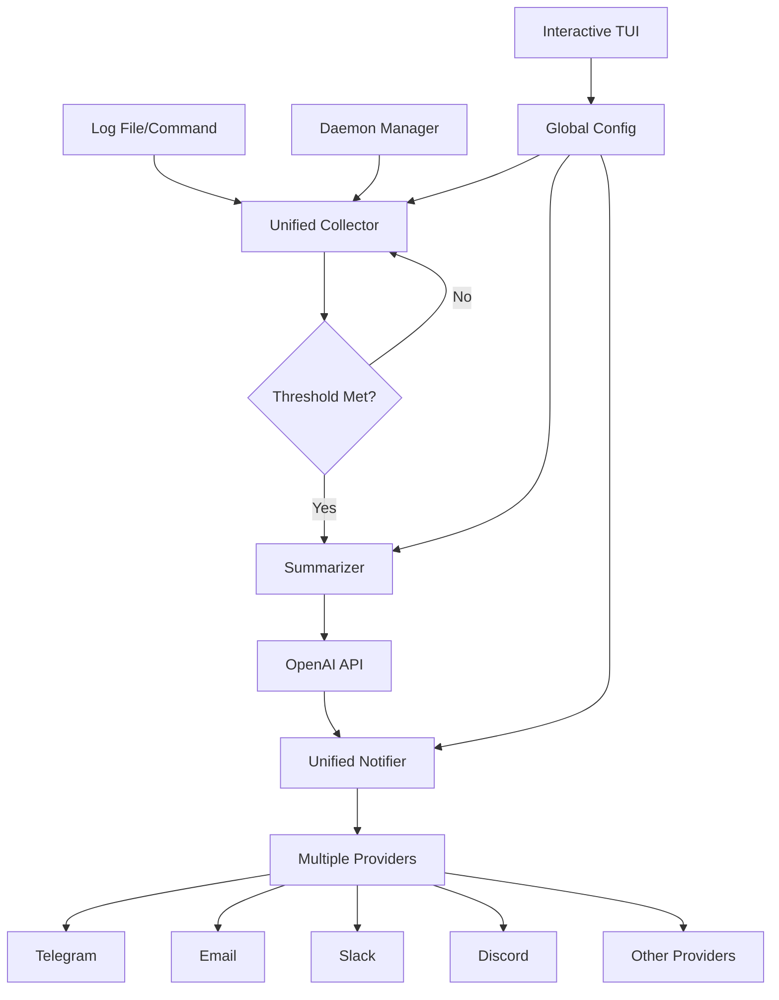

# Architecture Overview

This document describes the architecture and design principles of Lai.

## Project Structure

```
lai/
├── main.go                          # Application entry point
├── Makefile                         # Development workflow commands
├── cmd/                            # CLI commands (Cobra)
│   ├── root.go                     # Root command and global flags
│   ├── start.go                    # Main start command with daemon support
│   ├── exec.go                     # Execute and monitor commands
│   ├── config.go                   # Configuration management commands with TUI
│   ├── monitor.go                  # Unified monitoring command
│   ├── list.go                     # List running daemon processes  
│   ├── logs.go                     # View daemon process logs
│   ├── stop.go                     # Stop running daemon processes
│   ├── resume.go                   # Resume stopped daemon processes
│   ├── clean.go                    # Clean stopped daemon processes
│   ├── test.go                     # Test command
│   └── version.go                  # Version information
├── internal/                       # Internal packages
│   ├── collector/                  # Unified log and command monitoring
│   │   ├── collector.go            # Core file monitoring implementation
│   │   ├── source.go               # Abstract monitor source interface
│   │   ├── stream_collector.go     # Command output monitoring
│   │   └── unified_monitor.go      # Unified monitoring system
│   ├── config/                     # Configuration management
│   │   └── config.go               # Global config with provider system
│   ├── daemon/                     # Daemon process lifecycle management
│   │   └── daemon.go               # Process registry and management
│   ├── logger/                     # Logging system
│   ├── notifier/                   # Unified notification system
│   │   ├── notifier.go             # Core notifier interfaces and templates
│   │   ├── notify_notifier.go      # notify library implementation
│   │   ├── email.go                # Email notification provider
│   │   └── *.go                    # Other provider implementations
│   ├── platform/                   # Platform-specific functionality
│   ├── summarizer/                 # OpenAI integration
│   │   └── summarizer.go           # GPT API interaction
│   ├── tui/                        # Interactive TUI for configuration
│   │   ├── model.go                # Main TUI model
│   │   ├── navigation.go           # Navigation logic
│   │   ├── styles.go               # UI styling
│   │   ├── delegate.go             # List delegate
│   │   └── utils.go                # Utility functions
│   └── version/                    # Version management
├── docs/                           # Documentation
│   ├── DEVELOPMENT.md              # Development guide
│   ├── CONFIGURATION.md            # Configuration reference
│   └── ARCHITECTURE.md             # This document
├── testdata/                       # Test data files
├── scripts/                        # Build and test scripts
├── config.example.yaml             # Example configuration
└── integration_test.go             # Integration tests
```

## Architecture Patterns

### Clean Architecture

Lai follows clean architecture principles with clear separation of concerns:

- **Presentation Layer** (`cmd/`): CLI interface and command handling with interactive TUI
- **Application Layer** (`internal/`): Business logic and domain models
- **Infrastructure Layer** (`internal/{notifier,summarizer}`): External service integrations

### Provider-based Architecture

The notification system uses a provider-based architecture for flexibility:

```go
// ServiceConfig represents a single notification service configuration
type ServiceConfig struct {
    Enabled  bool                   `mapstructure:"enabled" yaml:"enabled"`
    Provider string                 `mapstructure:"provider" yaml:"provider"`
    Config   map[string]interface{} `mapstructure:"config" yaml:"config"`
    Defaults map[string]interface{} `mapstructure:"defaults" yaml:"defaults"`
}

// Example provider configurations
"telegram": {
    Enabled:  true,
    Provider: "telegram",
    Config:   map[string]interface{}{
        "bot_token": "...",
        "chat_id":   "...",
    },
    Defaults: map[string]interface{}{
        "parse_mode": "markdown",
    },
}
```

### Dependency Injection

Components are loosely coupled through dependency injection:

```go
// Main assembly in cmd/start.go
monitorSource := collector.NewFileSource(logFile)
cfg, err := collector.BuildMonitorConfig(monitorSource, lineThreshold, checkInterval, ...)
monitor, err := collector.NewUnifiedMonitor(cfg)

// Dependencies are injected, not created internally
// The unified monitor handles all component coordination
```

### Interface Segregation

The notification system uses multiple interfaces for different needs:

```go
// Legacy interface for backward compatibility
type Notifier interface {
    SendMessage(message string) error
    SendLogSummary(filePath, summary string) error
}

// New unified interface with context support
type UnifiedNotifier interface {
    SendLogSummary(ctx context.Context, filePath, summary string) error
    SendMessage(ctx context.Context, message string) error
    SendError(ctx context.Context, filePath, errorMsg string) error
    TestProvider(ctx context.Context, providerName string, message string) error
    IsEnabled() bool
    GetEnabledChannels() []string
}
```

## Core Components

### 1. Unified Collector (`internal/collector/`)

**Responsibility**: Monitor both log files and command outputs through a unified interface

**Architecture**:
- **MonitorSource Interface**: Abstract source of monitoring data
- **File Collector**: Monitors log files using filesystem events
- **Stream Collector**: Captures stdout/stderr from running commands
- **Unified Monitor**: Coordinates all monitoring operations

**Key Features**:
- Source abstraction for different monitoring types
- Line-based change detection
- Configurable thresholds for triggering notifications
- Error-only mode for selective monitoring

### 2. Unified Notifier (`internal/notifier/`)

**Responsibility**: Send notifications through multiple channels using a unified system

**Architecture**:
- **UnifiedNotifier Interface**: Modern context-aware notification interface
- **Notify Library Integration**: Uses the `notify` library for provider support
- **Provider System**: Configurable notification providers (Telegram, Email, Slack, Discord, etc.)
- **Fallback Support**: Configurable fallback providers

**Key Features**:
- Multiple notification providers supported
- Context-aware operations with proper error handling
- Provider testing functionality
- Legacy configuration migration
- Template-based message formatting

### 3. Configuration Management (`internal/config/`)

**Responsibility**: Handle application configuration with a global provider system

**Architecture**:
- **Global Configuration**: Centralized configuration at `~/.lai/config.yaml`
- **Provider-based Notifications**: Unified notification provider configuration
- **Automatic Migration**: Seamless migration from legacy configurations
- **Interactive TUI**: Bubble Tea-based configuration interface

**Key Features**:
- Global configuration file management
- Provider-based notification system
- Environment variable support
- Command-line override support
- Interactive configuration TUI
- Configuration validation

### 4. Interactive TUI (`internal/tui/`)

**Responsibility**: Provide user-friendly interactive configuration interface

**Architecture**:
- **Bubble Tea Framework**: Modern terminal UI framework
- **ConfigModel**: Main model for state management
- **Navigation System**: Hierarchical navigation with breadcrumbs
- **Dynamic Forms**: Type-specific input handling

**Key Features**:
- Hierarchical configuration navigation
- Type-specific input validation
- Real-time configuration preview
- Context-sensitive help
- Responsive terminal sizing

### 5. Summarizer (`internal/summarizer/`)

**Responsibility**: Generate AI-powered summaries of log content

**Features**:
- OpenAI GPT integration
- Configurable models and endpoints
- Context-aware summarization
- Error analysis for error-only mode
- Configurable language support

### 6. Daemon Manager (`internal/daemon/`)

**Responsibility**: Manage background monitoring processes

**Features**:
- Process registry and lifecycle management
- Persistent state storage
- Process health monitoring
- Graceful shutdown handling
- Resume functionality for stopped processes

## Data Flow



## Key Design Decisions

### 1. Unified Notification System

**Decision**: Use the `notify` library for provider-based notifications
**Rationale**: 
- Extensible provider system
- Reduced maintenance overhead
- Consistent API across providers
- Built-in error handling and retry logic

### 2. Provider-based Configuration

**Decision**: Implement provider-based notification configuration
**Rationale**:
- Unified configuration structure
- Easy to add new providers
- Consistent validation and defaults
- Better organization of complex configurations

### 3. Interactive TUI Configuration

**Decision**: Add interactive configuration interface using Bubble Tea
**Rationale**:
- Better user experience
- Reduced configuration errors
- Context-sensitive help
- Hierarchical navigation

### 4. Global Configuration System

**Decision**: Implement global configuration at `~/.lai/config.yaml`
**Rationale**:
- Centralized configuration management
- No need for per-project config files
- Easy to maintain and backup
- Consistent configuration across all runs

### 5. Unified Monitoring System

**Decision**: Create unified monitoring system for files and commands
**Rationale**:
- Consistent API for different monitoring types
- Reduced code duplication
- Easier to add new monitoring sources
- Better error handling and validation

### 6. Automatic Configuration Migration

**Decision**: Implement automatic configuration migration
**Rationale**:
- Seamless upgrades between versions
- No manual configuration changes required
- Backward compatibility maintained
- Gradual migration to new features

## Architecture Patterns and Principles

### 1. Interface Segregation

- Multiple interfaces for different use cases
- Legacy interface for backward compatibility
- Modern interface for new features
- Clear separation of concerns

### 2. Dependency Inversion

- High-level modules don't depend on low-level modules
- Both depend on abstractions (interfaces)
- Easy to swap implementations
- Better testability

### 3. Single Responsibility

- Each package has a single responsibility
- Clear separation between monitoring, notification, and configuration
- Focused modules with well-defined boundaries
- Easier to maintain and extend

### 4. Open/Closed Principle

- Open for extension (new providers, monitoring sources)
- Closed for modification (stable interfaces)
- Plugin architecture for notifications
- Abstract monitoring sources

## Configuration Architecture

### 1. Global Configuration Structure

```yaml
version: "1.0.0"
notifications:
  openai:
    api_key: "sk-..."
    base_url: "https://api.openai.com/v1"
    model: "gpt-3.5-turbo"
  providers:
    telegram:
      enabled: true
      provider: "telegram"
      config:
        bot_token: "..."
        chat_id: "..."
      defaults:
        parse_mode: "markdown"
    email:
      enabled: false
      provider: "smtp"
      config:
        host: "smtp.gmail.com"
        port: 587
        username: "..."
        password: "..."
      defaults:
        subject: "🚨 Log Summary Notification"
  fallback:
    enabled: false
    provider: "email"
    config: {}
defaults:
  line_threshold: 10
  check_interval: "30s"
  final_summary: true
  final_summary_only: false
  error_only_mode: false
  language: "English"
logging:
  level: "info"
```

### 2. Configuration Features

- **Provider Management**: Easy enable/disable of notification providers
- **Default Values**: Sensible defaults with override capabilities
- **Validation**: Comprehensive configuration validation
- **Migration**: Automatic migration from legacy configurations
- **Interactive Editing**: TUI-based configuration management

## Notification System Architecture

### 1. Provider Architecture

```go
// Core notification interface
type UnifiedNotifier interface {
    SendLogSummary(ctx context.Context, filePath, summary string) error
    SendMessage(ctx context.Context, message string) error
    SendError(ctx context.Context, filePath, errorMsg string) error
    TestProvider(ctx context.Context, providerName string, message string) error
    IsEnabled() bool
    GetEnabledChannels() []string
}

// Provider factory
func CreateUnifiedNotifier(cfg *config.Config) (UnifiedNotifier, error) {
    // Handles configuration migration
    // Creates notify library integration
    // Sets up all enabled providers
}
```

### 2. Supported Providers

- **Telegram**: Bot API with markdown support
- **Email**: SMTP with SSL/TLS support
- **Slack**: Webhook and OAuth support
- **Discord**: Bot token and webhook support
- **Pushover**: Push notification service
- **Twilio**: SMS notifications
- **PagerDuty**: Incident management
- **DingTalk**: Enterprise messaging
- **WeChat**: Enterprise messaging

### 3. Features

- **Fallback Support**: Configurable fallback providers
- **Provider Testing**: Test individual providers
- **Template System**: Consistent message formatting
- **Error Handling**: Robust error handling and retry logic
- **Context Awareness**: Proper context handling for operations

## Testing Strategy

### 1. Unit Tests

Each package has comprehensive unit tests:
- Mock external dependencies
- Test error conditions
- Validate business logic
- Test configuration scenarios

### 2. Integration Tests

End-to-end testing in `integration_test.go`:
- Test complete workflows
- Validate daemon lifecycle
- Test configuration scenarios
- Test notification delivery

### 3. Test Coverage

Current project coverage: 46.4%
- HTML coverage reports available
- Focused on core business logic
- Mock external service calls

### 4. Test Utilities

Shared testing utilities in `internal/testutils/`:
- Mock implementations
- Test data generation
- Common test scenarios

## Extensibility Points

### 1. New Notification Providers

To add a new notification provider:

1. Add provider configuration to `config.go`
2. Update provider setup in `notify_notifier.go`
3. Add provider-specific validation
4. Update configuration examples

### 2. New Monitoring Sources

To add new monitoring sources:

1. Implement `MonitorSource` interface
2. Add source type to `unified_monitor.go`
3. Update configuration validation
4. Add command line support

### 3. New AI Providers

To add new AI providers:

1. Extend summarizer interfaces
2. Implement provider-specific logic
3. Add configuration options
4. Update validation logic

## Performance Characteristics

### 1. Resource Usage

- Low memory footprint (~10-50MB per process)
- Minimal CPU usage during idle periods
- Configurable check intervals to balance performance
- Efficient file watching using filesystem events

### 2. Scalability

- Multiple daemon processes supported
- Independent monitoring sessions
- No shared state between processes
- Provider-based notification scaling

### 3. Network Usage

- Minimal API calls (only when thresholds met)
- Configurable batch sizes
- Efficient notification provider usage
- Fallback provider support

## Security Considerations

### 1. Configuration Security

- API keys stored in user's home directory
- File permissions are restrictive (600)
- Environment variables support for CI/CD
- Sensitive field handling in TUI

### 2. Input Validation

- All user inputs are validated
- File paths are sanitized
- Command arguments are properly escaped
- Configuration validation

### 3. Process Isolation

- Daemon processes run with user privileges
- No elevated permissions required
- Clean process lifecycle management
- Signal handling

## Future Enhancements

### 1. Advanced Features

- **Web Dashboard**: Web-based management interface
- **API Server**: RESTful API for integration
- **Database Storage**: Optional database backend
- **Advanced Filtering**: More sophisticated log filtering
- **Machine Learning**: Enhanced error detection

### 2. Monitoring Enhancements

- **Remote Monitoring**: Monitor remote log files
- **Database Monitoring**: Database log monitoring
- **Application Monitoring**: Application performance monitoring
- **Custom Metrics**: User-defined metrics and alerts

### 3. Notification Enhancements

- **Notification Templates**: Advanced templating system
- **Notification Scheduling**: Scheduled notifications
- **Notification Groups**: Group-based notifications
- **Escalation Policies**: Multi-level escalation
- **Integration Platforms**: More integration platforms