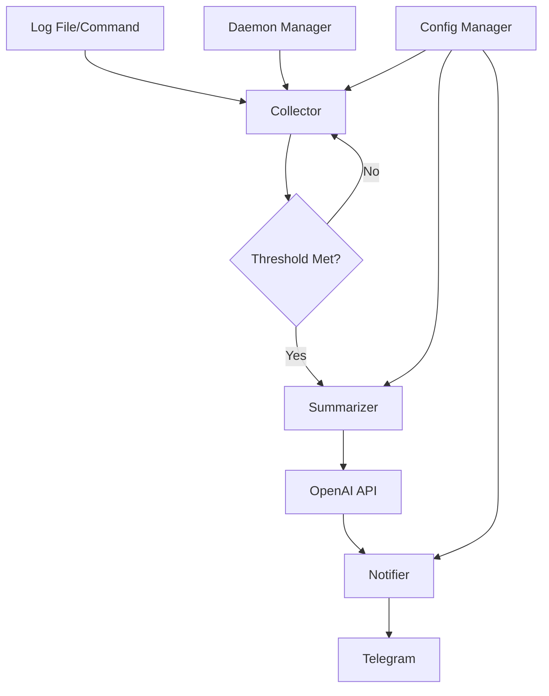

# Architecture Overview

This document describes the architecture and design principles of Lai.

## Project Structure

```
lai/
├── main.go                          # Application entry point
├── Makefile                         # Development workflow commands
├── cmd/                            # CLI commands (Cobra)
│   ├── root.go                     # Root command and global flags
│   ├── start.go                    # Main start command with daemon support
│   ├── exec.go                     # Execute and monitor commands
│   ├── config.go                   # Configuration management commands
│   ├── list.go                     # List running daemon processes  
│   ├── logs.go                     # View daemon process logs
│   ├── stop.go                     # Stop running daemon processes
│   ├── resume.go                   # Resume stopped daemon processes
│   ├── clean.go                    # Clean stopped daemon processes
│   └── version.go                  # Version information
├── internal/                       # Internal packages
│   ├── collector/                  # Log file and command output monitoring
│   │   ├── collector.go            # File monitoring implementation
│   │   └── stream_collector.go     # Command output monitoring
│   ├── config/                     # Configuration management
│   │   └── config.go               # Config struct and validation
│   ├── daemon/                     # Daemon process lifecycle management
│   │   └── daemon.go               # Process registry and management
│   ├── notifier/                   # Telegram notifications
│   │   └── notifier.go             # Telegram bot integration
│   ├── summarizer/                 # OpenAI integration
│   │   └── summarizer.go           # GPT API interaction
│   └── testutils/                  # Shared testing utilities
├── docs/                           # Documentation
│   ├── DEVELOPMENT.md              # Development guide
│   ├── CONFIGURATION.md            # Configuration reference
│   └── ARCHITECTURE.md             # This document
├── testdata/                       # Test data files
├── scripts/                        # Build and test scripts
├── config.example.yaml             # Example configuration
└── integration_test.go             # Integration tests
```

## Architecture Patterns

### Clean Architecture

Lai follows clean architecture principles with clear separation of concerns:

- **Presentation Layer** (`cmd/`): CLI interface and command handling
- **Application Layer** (`internal/`): Business logic and domain models
- **Infrastructure Layer** (`internal/{notifier,summarizer}`): External service integrations

### Dependency Injection

Components are loosely coupled through dependency injection:

```go
// Main assembly in cmd/start.go
collector := collector.New(config.LogFile)
summarizer := summarizer.New(config.OpenAI)
notifier := notifier.New(config.Telegram)

// Dependencies are injected, not created internally
monitor := NewMonitor(collector, summarizer, notifier)
```

### Command Pattern

Each CLI command is implemented as a separate module in the `cmd/` package, following the Cobra CLI framework patterns.

## Core Components

### 1. Collector (`internal/collector/`)

**Responsibility**: Monitor log files and command outputs for changes

**Types**:
- **File Collector**: Monitors log files using file system events
- **Stream Collector**: Captures stdout/stderr from running commands

**Key Features**:
- Efficient file watching using filesystem events
- Line-based change detection
- Configurable thresholds for triggering notifications

### 2. Summarizer (`internal/summarizer/`)

**Responsibility**: Generate AI-powered summaries of log content

**Features**:
- OpenAI GPT integration
- Configurable models and endpoints
- Context-aware summarization
- Error handling and retry logic

### 3. Notifier (`internal/notifier/`)

**Responsibility**: Send notifications to external services

**Current Implementation**:
- Telegram bot integration
- Formatted message delivery
- Chat/group support

**Extensible Design**: Easy to add new notification channels (email, Slack, etc.)

### 4. Daemon Manager (`internal/daemon/`)

**Responsibility**: Manage background monitoring processes

**Features**:
- Process registry and lifecycle management
- Persistent state storage
- Process health monitoring
- Graceful shutdown handling

### 5. Configuration (`internal/config/`)

**Responsibility**: Handle application configuration

**Features**:
- Global configuration file management
- Environment variable support
- Command-line override support
- Configuration validation

## Data Flow



## Key Design Decisions

### 1. File-based Process Registry

**Decision**: Use file-based storage for daemon process registry
**Rationale**: 
- Simple and reliable
- Survives application restarts
- Easy to inspect and debug
- No external database dependency

### 2. Polling vs. Event-driven Monitoring

**Decision**: Hybrid approach - events for file changes, polling for command output
**Rationale**:
- File monitoring uses efficient filesystem events
- Command monitoring requires polling (no events available)
- Configurable intervals balance responsiveness and resource usage

### 3. Single Binary Distribution

**Decision**: All functionality in one binary
**Rationale**:
- Simplified deployment and distribution
- No dependency management issues
- Easy to install and run

### 4. Cobra CLI Framework

**Decision**: Use Cobra for CLI implementation
**Rationale**:
- Standard in Go ecosystem
- Rich feature set (subcommands, flags, help)
- Excellent documentation and community support

## Error Handling Strategy

### 1. Wrapped Errors

All errors are wrapped with context using `fmt.Errorf`:

```go
if err != nil {
    return fmt.Errorf("failed to start monitoring %s: %w", filename, err)
}
```

### 2. Graceful Degradation

Components fail gracefully:
- Network failures don't stop monitoring
- Invalid configuration shows helpful messages
- Resource exhaustion is handled cleanly

### 3. Retry Logic

External API calls implement exponential backoff:
- OpenAI API failures are retried
- Telegram delivery failures are retried
- File system errors are retried with backoff

## Testing Strategy

### 1. Unit Tests

Each package has comprehensive unit tests:
- Mock external dependencies
- Test error conditions
- Validate business logic

### 2. Integration Tests

End-to-end testing in `integration_test.go`:
- Test complete workflows
- Validate daemon lifecycle
- Test configuration scenarios

### 3. Test Utilities

Shared testing utilities in `internal/testutils/`:
- Mock implementations
- Test data generation
- Common test scenarios

## Extensibility Points

### 1. New Notification Channels

To add a new notification channel:

1. Create new package in `internal/notifier/`
2. Implement the notifier interface
3. Add configuration options
4. Integrate in command handlers

### 2. New Monitoring Sources

To add new monitoring sources:

1. Extend collector interfaces
2. Implement new collector types
3. Update command handlers
4. Add configuration support

### 3. New AI Providers

To add new AI providers:

1. Extend summarizer interfaces
2. Implement provider-specific logic
3. Add configuration options
4. Update validation logic

## Security Considerations

### 1. Configuration Security

- API keys are stored in user's home directory
- File permissions are restrictive (600)
- Environment variables support for CI/CD

### 2. Input Validation

- All user inputs are validated
- File paths are sanitized
- Command arguments are properly escaped

### 3. Process Isolation

- Daemon processes run with user privileges
- No elevated permissions required
- Clean process lifecycle management

## Performance Characteristics

### 1. Resource Usage

- Low memory footprint (~10-50MB per process)
- Minimal CPU usage during idle periods
- Configurable check intervals to balance performance

### 2. Scalability

- Multiple daemon processes supported
- Independent monitoring sessions
- No shared state between processes

### 3. Network Usage

- Minimal API calls (only when thresholds met)
- Configurable batch sizes
- Efficient Telegram bot API usage